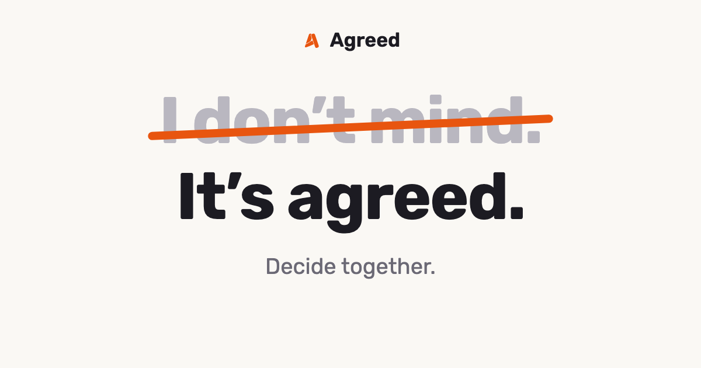

# Agreed for Claude

**47 messages. 0 decisions.**

You know the thread. Someone asks where to eat, everyone says "I don't mind", and an hour later nobody has booked anything.

Claude is brilliant at suggesting where to eat. What it can't do is get five people to agree. Agreed does that part. Claude puts its suggestions to your group as one link, everyone swipes yes or no on their own phone, and you find out what you all actually want.

## How it works

1. **Ask Claude.** "Help us pick a film for Friday. No horror, nothing over two hours."
2. **Watch the deck deal itself.** Claude's suggestions land in your chat as cards, each with a reason it's a contender.
3. **Send one link.** Drop it in the group chat. Nobody needs the app or an account.
4. **Everyone swipes.** Yes or no, on their own phone, in about a minute. You see them arrive and finish, right there in the card.
5. **It's agreed.** When the last person is done, the card reveals what the group picked, and Claude can help with what comes next.

## Try asking

- "Help us decide on a date-night spot near Clapham"
- "We can't decide on a weekend away from London in May"
- "Help us choose a baby name we'd both love"
- "Here's the link Sam sent. Add Padella and Bao."
- "Has everyone done it? What did they pick?"

## Add it

**In Claude** (web and desktop, then it's on your phone too): go to Customize, then Plugins, choose Add marketplace and paste `fkealy/agreed-claude-plugin`. Install Agreed, then connect it from the plugin's Connectors tab.

**In Claude Code:**

```
/plugin marketplace add fkealy/agreed-claude-plugin
/plugin install agreed@agreed
```

**Just the connector:** in Claude, go to Customize, then Connectors, choose Add custom connector and paste `https://mcp.getagreed.app/mcp`.

Agreed is on its way to Claude's directory. Once it's listed, adding it is one tap.

## What Claude sees, and what it doesn't

- **It sees** the options it suggested, the room's links, and how many people have finished.
- **It never sees** your friends' names, or who said yes to what.
- **The answer waits for the group.** Claude hears the result once everyone's done, not before.
- **Photos stay in Agreed.** They load when your group opens the link, never inside the chat.

Rooms nobody uses are deleted. The details are in our [privacy policy](https://getagreed.app/privacy).

## What's inside

| File                              | What it does                                                                                                                |
| --------------------------------- | --------------------------------------------------------------------------------------------------------------------------- |
| `skills/decide-together/SKILL.md` | Teaches Claude when a choice belongs to a group, and how to deal a good deck.                                               |
| `.mcp.json`                       | Connects Claude to Agreed at `mcp.getagreed.app/mcp`, with three tools: `decide_together`, `add_options` and `room_status`. |
| `.claude-plugin/`                 | The plugin's name and details, and its marketplace entry.                                                                   |

No sign-in, no API key, nothing to set up.

## Help

[getagreed.app/claude](https://getagreed.app/claude) · [support@getagreed.app](mailto:support@getagreed.app) · [status.getagreed.app](https://status.getagreed.app)

MIT licensed. Made by [Agreed](https://getagreed.app).
